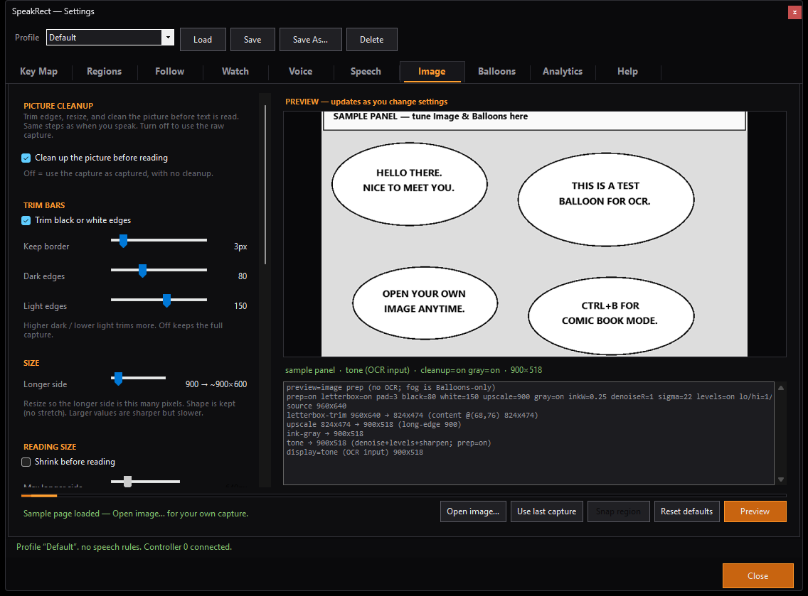
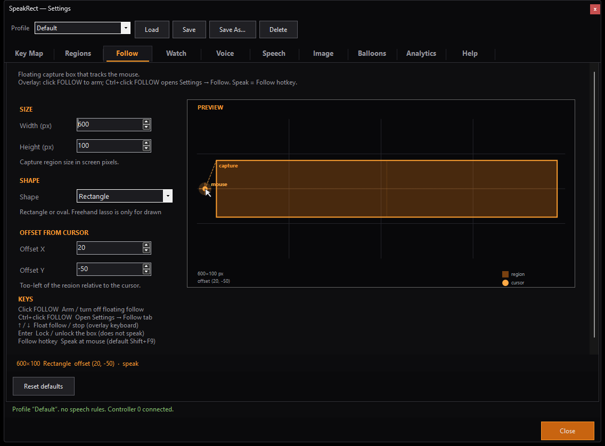
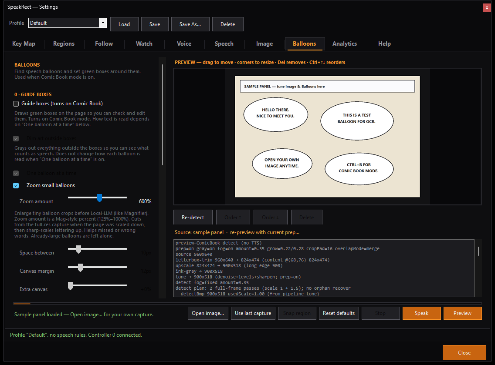

# SpeakRect

SpeakRect is a Windows tray app that reads text off the screen and speaks it.

A lot of the text people need is not a real control. RPG dialogue in an emulator, a menu in a modern game, a comic balloon, a subtitle burned into the frame: it is paint. A screen reader never sees it. SpeakRect does not hook the game either. You draw a box (or several), it snapshots those pixels, a local vision model turns them into words, and Windows speech reads them aloud.

That is the whole mechanism, and it is also the main limitation: capture is a desktop screenshot. **Borderless windowed** or a normal window works. Exclusive fullscreen usually does not.

Recognition stays on your PC. Captures are not sent to a cloud OCR API. Speech uses the voices already installed on Windows.



## What it is not

- Not Narrator, NVDA, or any UI Automation screen reader. It does not walk the control tree or announce buttons.
- Not a comic viewer, emulator, or an overlay that draws *inside* a game.
- Not cloud OCR. There is no account and no upload of screen captures.
- Not a promise of perfect reads. Fancy lettering, SFX, motion blur, low contrast, and tiny credits still get mangled.
- Not a general translation tool. The default reading prompt asks for English; other languages are untested.

If Windows can show it on the desktop, SpeakRect can try to read it. That is the bar.

## Download

| | |
|--|--|
| **Latest build** | [Releases](https://github.com/dunjeon/SpeakRect/releases/latest) |
| **Package** | One zip: `SpeakRect.exe` + local LLM host + Q8_0 model files |
| **Source** | This repository, **GPLv2** |

### Install

1. Download `SpeakRect-<version>-win-x64.zip` from the [latest release](https://github.com/dunjeon/SpeakRect/releases/latest).
2. Extract it somewhere with about **2.5 GB** free. Keep `SpeakRect.exe` and the `koboldcpp` folder together.
3. Run **`SpeakRect.exe`**. It lives in the system tray. The model may take a short time to load on first launch.

No separate model download is required for the complete zip.

Source clones keep the same host and models under `koboldcpp\` via **Git LFS** (`git lfs install` before clone). Ready-to-run zips stay on Releases.

### Windows SmartScreen / “Unknown publisher”

Windows may warn on first run (“Windows protected your PC”, unknown publisher, browser warnings on the zip). That is expected. SpeakRect is free and the GitHub zip is **unsigned**. The warning means Microsoft does not recognize the publisher, not that the file was found to be malware.

To run it: SmartScreen → **More info** → **Run anyway**.

If the file stays blocked after download, right-click `SpeakRect.exe` (or the zip) → **Properties** → check **Unblock** if it is there → **OK**. Or from PowerShell in the extract folder:

```powershell
Unblock-File -Path .\SpeakRect.exe
Get-ChildItem -Recurse | Unblock-File
```

Only download from the official [Releases](https://github.com/dunjeon/SpeakRect/releases) page. If a release lists a SHA-256:

```powershell
Get-FileHash -Algorithm SHA256 .\SpeakRect-*-win-x64.zip
```

## Requirements

| | |
|--|--|
| **OS** | Windows 10/11 **x64** (`net10.0-windows10.0.26100.0`) |
| **Disk** | ~2 GB for the bundled host + model, plus a little for the app |
| **GPU** | Strongly recommended |

The bundled host is set up for Vulkan, with **2 CPU threads** so a game can keep the rest. CPU-only is usually too slow to use live. Sharing a card with a demanding game needs spare VRAM; integrated and very small GPUs may not load the default model pair.

Advanced host settings live in `koboldcpp\ocr.kcpps`.

Only one instance of SpeakRect runs at a time. A second launch tells you to look in the tray.

## Quick start

1. Extract the zip so `SpeakRect.exe` and `koboldcpp\` stay together.
2. Run SpeakRect. Tray icon appears; the local model may still be loading.
3. **Shift+Tab** (or double-click the tray icon) shows the overlay.
4. Draw a box around the text (starts on region 1). Rectangle is the default; **R** / **O** / **L** pick rectangle, oval, or freehand lasso.
5. **Enter** speaks that region.
6. Still on the overlay: **Shift+F2**, draw region 2, Enter to test. Repeat up to eight saved slots.
7. **Escape** hides the overlay. After that, **Shift+F1** … **Shift+F8** speak those spots without opening the overlay.

For games, switch to **borderless windowed** first.

A typical layout: region 1 on the dialogue box, region 2 on choices, region 3 on a quest log. One profile per game so the hotkeys do not fight the title’s own binds.

## Overlay

The overlay is a dim full-screen layer over the desktop. Tools sit in a **left sidebar** that stays fully opaque. Drawing starts on region 1.

| | |
|--|--|
| Show / hide | **Shift+Tab**, tray **Show Overlay**, or a gamepad bind |
| Draw | Click and drag (not on the sidebar) |
| Speak current slot | **Enter** (regions 1–8) |
| Hide to tray | **Escape** (saves the current slot, stops speech) |
| Clear the active slot | **Delete** |
| Dim more / less | **←** / **→** while the overlay is open |

Picking RECT / OVAL / LASSO hides the sidebar so you can draw against the left edge. Esc brings the sidebar back; Esc again hides to the tray.

The overlay tint is cleared for the snapshot so the dim does not bake into the picture. Drawing is paused while Settings is open.

## Regions (slots 1–8)

Eight fixed slots, each with its own hotkey. Defaults are **Shift+F1** … **Shift+F8**. They are remappable.

With the overlay **open**, a region hotkey **selects** that slot so you can draw; it does not speak. With the overlay **closed**, the same hotkey speaks whatever is saved there.

Drawings save when you finish a shape, press Enter, switch slots, or hide the overlay.

| You want to… | Do this |
|--------------|---------|
| Speak region *n* | **Shift+F*n*** (overlay closed) |
| Move or resize a slot | Overlay on → that slot’s hotkey → draw again |
| Redraw 1 without losing 2 | Overlay on → **Shift+F1** → draw |
| See every slot on a map | Settings → **Regions** |

Follow (region 9) is separate and does not overwrite slots 1–8.

## Follow (region 9)

Follow is a floating capture box at the mouse — size, shape, and offset come from Settings → **Follow**. Use it for a subtitle line or anything that moves with the cursor.



| Default | |
|---------|--|
| **Shift+F9** | Speak at the current mouse using Follow size/shape/offset |
| **Up** / **Down** (overlay) | Arm the floating preview / turn Follow off |
| **Enter** while Follow is on | **Lock** or unlock the box. Does **not** speak. |
| Sidebar **FOLLOW** | Click on/off; **Ctrl+click** opens Follow settings |

Lasso is for drawn slots only. Follow is rectangle or oval.

## Watch

Watch is a timer on **one** saved slot (1–8). Follow cannot be watched.

Each tick: OCR answers a yes/no — is there text? No → silent, no model call. Yes → read with the **pipeline** and **text source** you picked, then speak if the words changed enough and nothing else is already talking.

| Setting | |
|---------|--|
| Pipeline | **Raw snap** (default, region pixels only), **Image** (Image-tab cleanup, one full-frame read), or **Image + Balloon** (cleanup + per-balloon reads) |
| Text source | **Local-LLM** (default) or **OCR** (faster, skips the model) |
| Interval | 0.5–60 seconds (default 2.0) |
| Forget last on no text | Empty box clears the last line so returning dialogue can be read again (default on) |
| Min difference | Speak only if the new line differs by at least this percent (default 90) |

Watch does **not** follow Default vs Comic Book. Opening the overlay stops it immediately. Settings open, or any in-progress speech, also holds it. The first successful check after you enable it (or change slot) is a silent baseline.

Toggle from Settings or **Ctrl+Shift+W**.

## Reading modes

One primary mode at a time. Global hotkeys use **Ctrl**, not Shift, so they do not fire while typing capitals.

| Mode | Default | |
|------|---------|--|
| **Default** | **Ctrl+D** | Games, menus, subtitles, ordinary UI. Image prep, then one full-frame read. |
| **Comic Book** | **Ctrl+B** | Panels and balloons. Detects balloon boxes, then reads them (optionally one at a time). |

When the overlay is hidden, a mode hotkey is announced with a short spoken phrase.

**Text source** (Settings → Speech) is independent of mode: **Local-LLM** (default) or **OCR**. Image prep, balloons, speech rules, pauses, and voice still apply either way. Watch has its own text source that overrides this.

### Comic Book

Settings → **Balloons** is where balloon detect is tuned. You can load the built-in sample, the last capture, or your own page; the green boxes (when guide boxes are on) can be dragged, resized, deleted, and reordered. **Speak** on that tab reads what you see.



Stock Comic Book turns on guide boxes, dims art outside the boxes, and sends one balloon at a time. Small lettering can be zoomed before the model sees it. None of that runs in Default mode.

Settings → **Image** is shared: letterbox trim, scale, ink-preserving gray, tone. Off = raw snap. The preview is the same cleanup used on a live speak.

## Settings

Tray **Settings…**, or **SETTINGS** on the overlay. Profile **Load / Save / Save As / Delete** sit on the bar at the top.

| Tab | |
|-----|--|
| **Key Map** | Keyboard and XInput gamepad; optional custom actions (clicks, key chords, stick-as-mouse) |
| **Regions** | Map of slots 1–8 |
| **Follow** | Mouse box size / shape / offset |
| **Watch** | Timer-read one saved slot |
| **Voice** | Windows TTS (default) or SAPI 5; rate, pitch, volume, pauses |
| **Speech** | Live text source, name substitutions, text-cleanup rules, reading prompt |
| **Image** | Capture cleanup, with live preview |
| **Balloons** | Balloon find/edit for Comic Book |
| **Analytics** | Last read: text, pipeline pictures, timings. Export writes a zip. |
| **Help** | In-app getting started, plus **Restore all defaults** |

A profile stores regions, hotkeys, modes, Follow, Watch, voice, speech rules, Image, and Balloons. `SpeakRect.ini` next to the exe is the live config; named profiles live under `Profiles\`. Switching games is the point of profiles.

Help → **Restore all defaults** resets the live settings (asks first) and keeps the profile name.

## Voice

**Default engine: Windows** (OneCore / UWP). Fresh installs and Restore use this, so speech works with whatever voices Windows already has. Extra Windows voices: **Settings → Time & language → Speech**.

Rate, pitch, volume, and optional custom pauses (comma / sentence / balloon gap) are on the Voice tab. Silence options apply to the Windows engine only.

### Optional: SAPI 5

SAPI 5 is for classic Control Panel voices or a third-party SAPI engine. Microsoft Narrator “Natural” voices are **not** exposed to ordinary apps on the Windows engine; some community adapters register them as SAPI 5.

Example path — [NaturalVoiceSAPIAdapter](https://github.com/gexgd0419/NaturalVoiceSAPIAdapter) (unofficial, not shipped with SpeakRect):

1. Install from that project’s Releases (run the installer as admin; on 64-bit Windows install both 32- and 64-bit if you want every app covered).
2. Enable local Narrator voices in the adapter if that is what you want. Follow *their* README / wiki.
3. Confirm voices appear in **Control Panel → Speech Recognition → Text to Speech**.
4. In SpeakRect: **Voice → Engine → SAPI 5** → pick a voice → **Preview**.
5. **Save** the profile so engine and voice come back next time.

Adapters can break after a Windows update. If speech dies, switch Engine back to **Windows**. Online adapter voices may use the network; keep the Windows engine (or local-only SAPI voices) for fully offline speech.

## Speech rules and name packs

Settings → **Speech**:

- **Text source** — Local-LLM or OCR for live speak, Follow, and Balloons.
- **Names** — Find → Say-as substitutions (case-insensitive). Preview / Space samples the voice.
- **Text rules** — cleanup pipeline (noise, abbreviations, decorators).
- **Prompts** — the instruction sent with every Local-LLM read. Blank uses the built-in default (extract English text, do not describe the image, plain text only).

Name packs are `.txt` files in `NamePacks\` next to the exe. Nothing auto-loads at startup. **Speech → Names → Packs…**, pick a pack, Import. Shipped example: `x-men.txt`. How to write your own is in `NamePacks\README.md`.

## Default hotkeys

| Action | Default |
|--------|---------|
| Show / hide overlay | **Shift+Tab** |
| Default mode | **Ctrl+D** |
| Comic Book mode | **Ctrl+B** |
| Stop speech | **Ctrl+Shift+S** |
| Watch on / off | **Ctrl+Shift+W** |
| Speak region 1–8 | **Shift+F1** … **Shift+F8** |
| Speak Follow | **Shift+F9** |
| Rectangle / oval / lasso | **R** / **O** / **L** (overlay) |
| Speak current slot | **Enter** (overlay, regions 1–8) |
| Lock / unlock Follow | **Enter** (overlay, Follow on) |
| Hide to tray | **Escape** |
| Clear active region | **Delete** |
| Follow preview on / off | **Up** / **Down** (overlay) |
| Overlay more transparent / opaque | **←** / **→** |

Remap everything in **Key Map**. Gamepad is opt-in (XInput, controller index 0–3). Custom actions can send clicks, chords, and stick-as-mouse so a pad can drive the overlay without the keyboard.

## Privacy

Recognition uses a local vision model. HTTP to the host is **loopback only** (`127.0.0.1`). SpeakRect does not upload screen captures for OCR.

Speech is on-device (Windows TTS, or SAPI 5 / a registered local engine). If you enable an adapter’s *online* voices, that path is outside SpeakRect and may use the network.

## Build from source

See [CONTRIBUTING.md](CONTRIBUTING.md). Short version:

```powershell
git lfs install
git clone https://github.com/dunjeon/SpeakRect.git
cd SpeakRect
dotnet build SpeakRect.sln -c Debug
dotnet test tests/SpeakRect.Tests
```

If files under `koboldcpp\` are tiny text stubs, run `git lfs pull`.

## License

SpeakRect application source is **GNU GPL v2** — see [LICENSE](LICENSE).

The bundled local-LLM host and GLM-OCR weights keep **their own** licenses. See [THIRD_PARTY_NOTICES.md](THIRD_PARTY_NOTICES.md). Redistributing a build that includes the host binary means complying with that host’s AGPL source-offer for the exact version you ship.

| Component | |
|-----------|--|
| Local-LLM host | **KoboldCpp** (LostRuins) — [GitHub](https://github.com/LostRuins/koboldcpp) |
| Vision model | **GLM-OCR** (Z.ai / zai-org), Q8_0 GGUF + projector — [GitHub](https://github.com/zai-org/GLM-OCR), [Hugging Face](https://huggingface.co/zai-org/GLM-OCR) |

The install folder is still named `koboldcpp\` (host binary + `glmocr-Q8_0.gguf` + `mmproj-glmocr-Q8_0.gguf` + `ocr.kcpps`).
