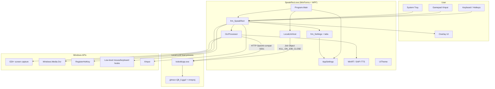
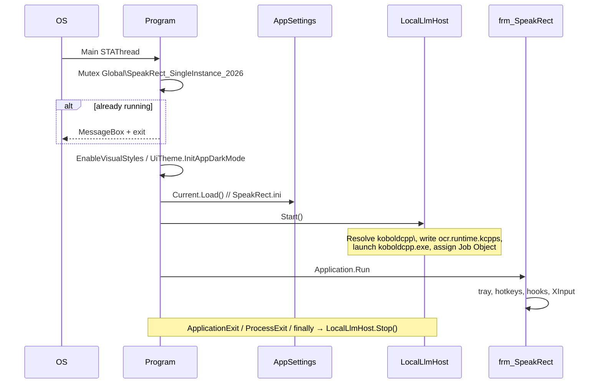
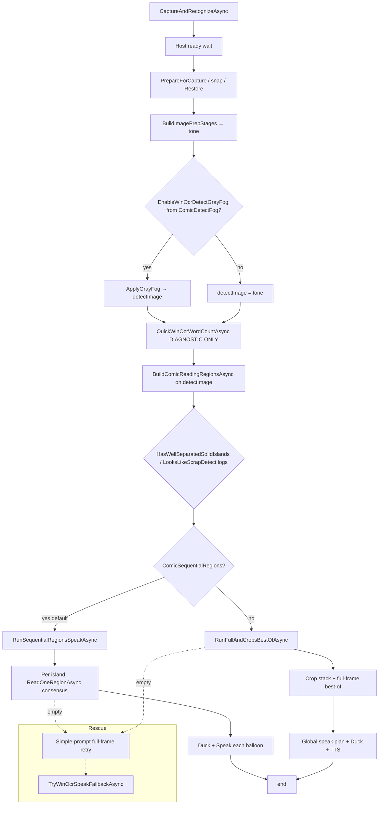
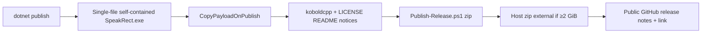
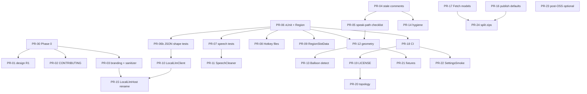

# SpeakRect — Software Engineering Design Document + Open-Source Readiness

| Field | Value |
|-------|--------|
| **Document** | As-built architecture + OSS readiness design |
| **Product** | SpeakRect **1.4.23** |
| **Author** | Product owner / maintainer |
| **Date** | 2026-07-30 (R6 public full-source) |
| **Status** | **Open source live** — public full source on `dunjeon/SpeakRect`; private dual-repo retired |
| **Revision** | **R6** — public topology flip; R5 Obfuscar removal retained |
| **Codebase** | Public [`dunjeon/SpeakRect`](https://github.com/dunjeon/SpeakRect) (`main` @ 1.4.23+) |
| **Audience** | Senior engineers; OSS contributors |
| **Git / releases** | `docs/GITHUB_REPOS.md` |
| **Speak-path gate** | `docs/architecture/speak-path-checklist.md` |
| **Smokes** | `docs/dev/smoke-runbook.md` |

---

## Overview

SpeakRect is a free Windows accessibility application for people with visual impairments. Users draw screen regions (rectangle, oval, or freehand lasso); the app captures those pixels, recognizes text with a **local vision LLM** (bundled KoboldCpp host + GLM-OCR GGUFs), and speaks via **Windows TTS** (default) or optional **SAPI 5**. No cloud recognition is required.

This document has two purposes:

1. **As-built architecture** — accurate enough that a new engineer can navigate the monorepo-style single project, find the speak path, host lifecycle, settings model, and build/publish pipeline (see Component inventory).
2. **Open-source readiness** — what was planned and **what has been executed** (Phases 0–7; R3–R4 modularization; **R5 Obfuscar removal** @ 1.4.23; **R6 public full-source** on `dunjeon/SpeakRect`).

**R6 as-built snapshot:** modularized (`SpeechCleaner` ~1.4k, **`ComicBestOfFusion` ~2.0k**, **`ComicRegionGeometry` ~550**, **`ComicConsensus` ~170**, **`BalloonOcrDetect` ~320**, **`ComicDetectTonePair`**, **`LowLevelInputHooks`** + **`OverlaySidebarChromeForm`**); `OcrProcessor` ~9.0k; `frm_SpeakRect` ~2.6k; **no Obfuscar**; **54** xUnit tests + CI; UI **OCR** / **Local-LLM**; app `LICENSE` **GPLv2**; **single public git remote** (no private source mirror).

> **Phase numbers vs PR numbers:** Phases (0–8) are **capability gates**. PR numbers were the original merge-order plan — most PR-00…20 items are **landed**; see the **PR Plan** section status table below.

---

## Background & Motivation

### Product goals

- Offline-first screen reading for games, comics, browsers, HUDs, and desktop UI.
- Low friction: tray app, remappable keyboard/gamepad, profiles per game, no cloud account.
- Two recognition modes:
  - **Default (ComicBook OFF):** shared image prep → one full-frame Local-LLM call.
  - **Comic Book ON:** shared image prep → Windows.Media.Ocr balloon detect (optional gray fog on detect only) → multi-island region pipeline → Local-LLM per crop / consensus / best-of → TTS.

### Engineering state (R5 — modularized + no obfuscation)

| Area | Was (R1 baseline ~1.4.19) | Now (1.4.23) |
|------|---------------------------|--------------|
| God-file density | `OcrProcessor` ~14.8k; `frm_SpeakRect` ~3.0k | `OcrProcessor` ~**9.0k**; `frm_SpeakRect` ~**2.6k**; fusion/geometry/consensus/detect modules extracted |
| Naming | Paddle* / KoboldCppHost / UI WinOCR+Kobold | **`LocalLlmHost`**, **`ExtractTextWithLocalLlmAsync`**, **`LocalLlmTaskPrompt`**; UI **OCR** + **Local-LLM** |
| Sanitizer | Kobold → “OCR” (bug) | Two-axis: Kobold* → Local-LLM, WinOCR → OCR |
| Detect vs tone | Easy to fog wrong bitmap | **`ComicDetectTonePair`** enforces fog-only-on-detect |
| Tests | Console smokes only | **`tests/SpeakRect.Tests`** (54 pure tests) + smokes; CI pure-only |
| License (app) | Proprietary | **GPLv2**; host AGPL remains third-party |
| Docs / contrib | Sparse | Design, speak-path checklist, CONTRIBUTING, SECURITY, COC, Fetch script |
| Packaging | Obfuscar + 2 GiB limit | **Obfuscar removed** (1.4.23); single-file + R2R; **`SkipKoboldPayload`** |

**Remaining (engineering):** multi-pass/orphan/mega-split still orchestrated in `OcrProcessor`; further `frm_SpeakRect` UI split optional; Fetch SHA pins when assets published; optional AGPL counsel.

### Why open source

Accessibility tools benefit from scrutiny and hardware matrix testing. **Full source** lives on public **`dunjeon/SpeakRect`** (GPLv2). Multi-GB Local-LLM binaries stay **out of git** and ship via release zips. See `docs/GITHUB_REPOS.md`.

---

## Goals & Non-Goals

### Goals

1. Document **as-built** architecture with real types, methods, and file paths (**R5**).
2. ~~Define~~ **Execute** multi-phase cleanup to contributor-ready state (Phases 0–7 engineering **done**).
3. User-visible terminology per **Glossary** (**done**).
4. Dead-code / comment hygiene (**done** for ban-list + stale short-circuit narratives).
5. Testing: pure xUnit + optional live smoke (**done** for L0; live remains optional).
6. OSS distribution strategy for ~2 GB payload (docs + Fetch + SkipKoboldPayload + **public full source** **done**).
7. Ordered PR plan (**mostly landed** — see status).

### Non-Goals

- Rewriting the OCR algorithm for accuracy in this document.
- Porting off Windows / WinForms+WPF.
- Replacing the KoboldCpp **binary** stack short-term (folder remains `koboldcpp\`).
- Shipping signed binaries or completing counsel/public-orphan ops in this doc alone.
- Phase 8 architecture splits (Core/App, overlay extract) — post-OSS optional.

---

## Glossary (user-facing product language)

Canonical product language (**implemented**).

| Concept | Canonical user-facing term | Also OK (secondary) | Banned in UI |
|---------|---------------------------|---------------------|--------------|
| Windows.Media.Ocr balloon/line detect | **OCR** | “detection”, “balloon detect” | WinOCR (as product brand) |
| Bundled vision model + host process | **Local-LLM** | “local model”, “local model host” | Kobold, KoboldCpp, KoboldCPP, PaddleOCR |
| Whole capture→read pipeline | **recognition** / “read” | — | Conflating detect with Local-LLM as one brand |
| TTS | **Windows speech** / **SAPI 5** | “voice” | — |

**Spelling:** **Local-LLM** in UI chrome; **Local LLM** OK in README prose. On-disk folder remains `koboldcpp\` (K7); third-party credits may name KoboldCpp.

**Implemented:** Balloons / Help / README / INI comments / sanitizer / announcements. `AppInfo.VersionLine` stays “local OCR + Windows TTS…”.

### `SanitizeUiEngineNames` — two-axis map (**done**)

| Match (ordered, longest first) | Replacement | Axis |
|--------------------------------|-------------|------|
| `KoboldCPP`, `KoboldCpp`, `Kobold` | **Local-LLM** | Recognition host |
| `WinOCR`, `WinOcr` | **OCR** | Detect |
| Never | Kobold → “OCR” | **Forbidden** |

| Surface | Mechanism |
|---------|-----------|
| Static labels | Edited string literals (Balloons, Help, etc.) |
| Dynamic pipeline detail | `UiTheme.SanitizeUiEngineNames` |
| Unit tests | `SanitizeUiEngineNamesTests` + ModeSmoke |

Debug logs may still use technical `WinOCR` / host prefixes; not user-facing.

---

## Key Decisions

| # | Status | Decision | Rationale |
|---|--------|----------|-----------|
| **K1** | **Done (R6)** | **Single public source-of-truth:** [`dunjeon/SpeakRect`](https://github.com/dunjeon/SpeakRect). Private `SpeakRect-src` **retired**. **Release zips** remain the primary binary channel. | Issues/PRs/source/releases in one place. |
| **K2** | **Approved for implementation** | **User-visible branding first** per Glossary: OCR + Local-LLM; **internal type renames later**. Fix `SanitizeUiEngineNames` two-axis map; never Kobold→OCR. | Low risk for users; avoids massive mechanical rename. |
| **K3** | **Done (1.4.23)** | **Obfuscar removed from all paths** (package, MSBuild targets, publish profile, release script, CI). | Open source prep; conflicts with R2R and contributor trust. |
| **K4** | **Approved for implementation** | **Do not put multi-GB models in public git clones.** Supported public paths: **release assets** + **`Fetch-LocalLlm.ps1`**. Current private tree uses **Git LFS** (not gitignore) for GGUF/exe — see LFS history strategy. | Clone pain, bandwidth, GitHub limits. |
| **K5** | **Decided (Q1)** | **App license: GPLv2** (root `LICENSE`). Counsel still recommended for **AGPL bundling / auto-launch** Combined Work analysis. Fallback if counsel objects: ship host as **optional download only** (no `CopyPayloadOnPublish` hard fail / no forced `Start()`). | “Separate process over localhost HTTP” is a **common engineering belief, not a legal conclusion**. SpeakRect **ships**, **auto-starts**, and **hard-depends** on a specific AGPL binary today — Combined Work analysis is required. Do **not** treat process isolation as sufficient mitigation alone. |
| **K6** | **Approved for implementation** | **Incremental god-file extraction**, not big-bang rewrite. Pure functions first, then HTTP client, then detect. | High regression risk on comic accuracy. |
| **K7** | **Approved for implementation** | **Keep folder `koboldcpp\` and `ocr.kcpps` on disk for v1 OSS**; UI says Local-LLM. | Existing install layout. |
| **K8** | **Approved for implementation** | **xUnit for pure logic; ModeSmoke optional live; CI = pure tests only.** | No GPU on PR agents. |
| **K9** | **Approved for implementation** | **Comment policy:** delete stale narratives (especially wrong pipeline headers); keep “why”/invariants. | Stale comments already re-document removed short-circuits. |
| **K10** | **Approved for implementation** | **Profiles remain INI** (`SpeakRect.ini`, `Profiles\*.ini`) for v1 OSS. | Simple, editable. |

### Decisions required before PR-16+ (OSS packaging / legal)

| Open Q | Blocks | Needed answer |
|--------|--------|---------------|
| Q1 License (MIT vs Apache vs GPL) | PR-19 | **GPLv2** applied (`LICENSE`) |
| Q2 Repo topology A vs B | PR-20 | **B done** — public `dunjeon/SpeakRect` only |
| Q4 Always-bundle models vs download-on-first-run / split zips | PR-17, PR-24, README | Install UX |
| Q5 Any obfuscated store build? | — | **Answered: delete** (1.4.23) |
| Q10 CLA vs DCO | PR-02 CONTRIBUTING, PR-19 | Contribution legal framework |

**Approved-now (can implement immediately):** K2, K4, K6, K7, K8, K9, K10, and all Phase 0–1 PRs.

---

## Architecture (as-built)

### High-level system



### Startup sequence



**Entry file:** [`Program.cs`](C:\Users\brook\source\repos\SpeakRect\Program.cs)

```csharp
// Mutex → AppSettings.Current.Load() → LocalLlmHost.Start() → Application.Run(new frm_SpeakRect())
// finally: LocalLlmHost.Stop(); mutex release
```

**Single-instance mutex:** `Global\\SpeakRect_SingleInstance_2026`

### Component inventory (R5 / 1.4.23)

| File | Lines (approx) | Responsibility | Notes |
|------|----------------|----------------|-------|
| `OcrProcessor.cs` | ~9,000 | Capture, prep, multi-pass detect orchestration, HTTP, TTS, smoke hooks | Thin wrappers to modules |
| `ComicBestOfFusion.cs` | ~2,030 | Best-of / residual / novel / full-frame split | R3 |
| `frm_SpeakRect.cs` | ~2,600 | Overlay, tray, speak entry | Hooks/chrome extracted (R4) |
| `AppSettings.cs` | ~2,580 | INI + profiles; modes; comic/image/voice | — |
| `frm_ComicRegions.cs` | ~1,750 | Balloons tab | — |
| `frm_SpeechRules.cs` | ~1,740 | Speech rules UI | — |
| `frm_HotkeyMap.cs` | ~1,550 | Key Map | — |
| `SpeechCleaner.cs` | ~1,430 | Pre-TTS clean pipeline | — |
| `UiTheme.cs` | ~1,020 | Theme + sanitizer | — |
| `LocalLlmHost.cs` | ~700 | Host process lifecycle | — |
| `ComicRegionGeometry.cs` | ~550 | Merge/sort/pad + heuristics | R3 |
| `HotkeyChord.cs` | ~400 | Chord parse/serialize | — |
| `BalloonOcrDetect.cs` | ~320 | Engine, **RunPassAsync**, cluster, SoftwareBitmap | **R4** |
| `GamepadButton.cs` | ~320 | Pad binding | — |
| `RegionSlotData.cs` | ~190 | Slot geometry INI | — |
| `ComicConsensus.cs` | ~170 | Diversified-decode voting | R3 |
| `LocalLlmClient.cs` | ~120 | Vision HTTP JSON | — |
| `ComicDetectTonePair.cs` | ~90 | Tone vs detect fog invariant | **R4** |
| `LowLevelInputHooks.cs` | ~80 | WH_* hooks + hotkey P/Invoke | **R4** |
| `OverlaySidebarChromeForm.cs` | ~70 | Opaque sidebar HWND | **R4** |
| `DetectedTextRegion.cs` | ~20 | Detect island type | — |
| `Program.cs` | ~62 | Mutex, host start/stop | — |
| `SpeakRect.csproj` | — | net10.0-windows, SkipKoboldPayload, **no Obfuscar** | Version **1.4.23** |
| `tests/SpeakRect.Tests/` | — | xUnit pure tests (54) | In solution; CI |
| `tests/*Smoke` | — | Console smokes | Live optional |
| `scripts/Fetch-LocalLlm.ps1` | — | Dev model/host bootstrap | SHA pins when assets publish |
| `.github/workflows/ci.yml` | — | Pure unit CI | plain build/test |
| `docs/*` | — | Design, checklist, decisions, inventories | — |

### Runtime process model

| Process | Role | Lifetime |
|---------|------|----------|
| `SpeakRect.exe` | UI, capture, OCR client, TTS | User session; single instance |
| `koboldcpp\koboldcpp.exe` | Local vision LLM HTTP server (OpenAI-compatible `/v1/`) | Started by `LocalLlmHost.Start()`; killed on exit via `Stop()` + Job Object `KILL_ON_JOB_CLOSE` |

**Default port:** `5001` from `ocr.kcpps` (`port` / `port_param`).

**API base:** `http://127.0.0.1:{port}/v1/` (`LocalLlmHost.ApiBaseUrl`).

**Health check:** `GET /v1/models`.

**Model id:** typically `koboldcpp/{stem of model_param}` e.g. `koboldcpp/glmocr-Q8_0`.

---

## Data flow: speak path

### Shared preamble (both modes)

Every `CaptureAndRecognizeAsync` run:

1. `LocalLlmHost.Start()` + `WaitUntilReadyAsync` (up to **3 minutes**) if API not ready — soft announcement if still cold
2. `PrepareForCapture` (dim overlay chrome) → short delay → `SnapCapture` → `RestoreAfterCapture` (always)
3. `DevCaptureCache.PublishLastCapture(rawSnap)` (full-res for Balloons)
4. Branch on `ComicBookOff` vs Comic ON
5. TTS path may `DuckOtherAudio` / `RestoreAudio` around speak

### Default mode (ComicBook OFF)


**Code path (primary):**

1. `frm_SpeakRect.StartSpeakKeepingOverlay` / region speak → `new OcrProcessor(...).Start()`
2. `OcrProcessor.CaptureAndRecognizeAsync` (shared preamble above)
3. If `ComicBookOff` → `RunComicBookOffPreparedSnapAsync`
4. `BuildImagePrepStages(rawSnap, buildTone: true)` → letterbox → upscale → ink gray → denoise/levels/sharpen (**tone** = Local-LLM input)
5. `RunFullFrameKoboldOnBitmapAsync` → `PrepareForLocalLlmOcr` → `ExtractTextWithLocalLlmAsync` → `LocalLlmClient.ChatAsync` (HTTP)
6. `SpeechCleaner.CleanForSpeech` / `SpeechCleaner.SplitSpeakPieces` → `SpeakWithSystemAsync`
7. Empty ladder may use OCR-detect text as TTS fallback (`TryWinOcrSpeakFallbackAsync`)

**As-built OFF behavior (accurate):** letterbox → upscale → ink-gray → tone → one full-frame Local-LLM call. No fog, no balloon detect, no crop stack.

### Comic Book mode (ComicBook ON)



#### Correctness debt: short-circuit narratives (resolved Phase 2–3)

**Live code:** Comic ON **always** runs detect + sequential/best-of. `QuickWinOcrWordCountAsync` is **diagnostic only** (detail log + timer).

**Resolved (2026-07-30):**

| Location | Was | Now |
|----------|-----|-----|
| `CaptureAndRecognizeAsync` header | Claimed word-count full-frame short-circuit | Documents always-detect + sequential/best-of |
| `DetectTextRegionsAsync` summary | “Only run when word-count…” | Always used on Comic path; not gated |
| `FullPipelineMinWinOcrWords` | Legacy const | **Removed** (Phase 2) |
| `QuickWinOcrWordCountAsync` XML | “Used to gate full detect” | Diagnostic only (Phase 3) |

**Regression rule:** reintroducing a full-frame-only short-circuit from word-count is a **fail**. Protect via `docs/architecture/speak-path-checklist.md` + extract review.

### Settings → `OcrProcessor` property bridge (comic / image)

Contributors grepping `ComicDetectFog` inside `OcrProcessor` will miss the private aliases:

| `AppSettings` | `OcrProcessor` consumer | Role |
|---------------|-------------------------|------|
| `ComicDetectFog` | `EnableWinOcrDetectGrayFog` | Master fog switch |
| `ComicDetectFogAmount` | `WinOcrDetectGrayFogAmount` | Fog strength (level const 128) |
| `ComicRegionPadding` | `TextRegionPadding` | Crop pad around islands |
| `ComicClusterGapX/Y`, inflate fracs, dense islands, orphan passes, min alnum, merge/split | various `Active*` / direct `AppSettings.Current.*` | Detect clustering / recovery |
| `ComicSequentialRegions` | read as `AppSettings.Current.ComicSequentialRegions` | Sequential vs best-of |
| Image prep knobs | `BuildImagePrepStages` / `ActivePipelineUpscaleLongSide` etc. | Shared Image tab pipeline |
| Prompts | `LocalLlmTaskPrompt` / `CropTaskPrompt` / `SimpleExtractPrompt` / `RecoveryPrompt` | Local-LLM prompts (full-frame / crop / simple / recovery) |

### Two prep layers (do not confuse)

| Layer | Methods | What it does |
|-------|---------|--------------|
| **Pipeline tone prep** | `BuildImagePrepStages` (letterbox, upscale, ink gray, denoise, auto-levels, unsharp) | Shared Image-tab look; produces **tone** bitmap Local-LLM reads; optional **fog** clone for detect only |
| **Encode / crop scale prep** | `PrepareForLocalLlmOcr` (full-frame), `PrepareCropForLocalLlmOcr` (crops) | **After** tone: optional scale+sharpen before HTTP encode (full-frame scale often off by default) |

There is **no** type named `ImagePrepPipeline` today — use `BuildImagePrepStages` / `PreviewImagePrep` until an extract PR introduces a facade.

**Comic detect pipeline** (`BuildComicReadingRegionsAsync` and helpers):

1. Multi-pass `RunWinOcrPassAsync` / `DetectTextRegionsAsync` on `detectImage` (fog or tone)
2. Cluster / improve boxes (`ClusterTextBoxesWithText`, `ImproveDetectedRegions`)
3. Orphan balloon blob recovery (`FillOrphanBalloonBlobsAsync`)
4. Dead-island filter (`FilterDeadDetectRegions`)
5. Coalesce reading blocks, compact collapse, mega-island split
6. Merge overlapping islands (respects grow + crop pad for overlap test)
7. Reading-order sort (`SortComicReadingOrderRegions`)
8. Same pipeline used by live speak, Balloons **Preview**, and Balloons speak-test (important invariant after 1.4.18 fixes)

**Post-detect diagnostics (logged; feed strategy detail):**

- `HasWellSeparatedSolidIslands` — solid multi-balloon geometry
- `LooksLikeScrapDetect` / low-confidence / fragmented flags — scrap vs solid messaging in `last_ocr` detail

**Sequential regions (default `ComicSequentialRegions = true`):**

- Local-LLM + TTS **per balloon** via `ReadOneRegionAsync` (consensus on crop)
- Under-read vs OCR-detect text → full-frame rescue when appropriate (`KoboldUnderReadsWinOcr`)
- Avoids global dedupe bag across balloons

**Non-sequential path:**

- `RunFullAndCropsBestOfAsync` — full frame + crop stack + diversified consensus → pick best speak units

**Empty ladder (comic):**

1. Full-frame with **simple** prompt (no settings flip)
2. OCR-detect text fallback for TTS (`TryWinOcrSpeakFallbackAsync`)

### Capture geometry

| Shape | Capture helper |
|-------|----------------|
| Rectangle | `CreateRectBitmap` |
| Ellipse | `CreateEllipseMaskedBitmap` |
| Lasso | `CreateMaskedBitmapFromLasso` |

Regions: **8 saved slots** (`AppSettings.RegionSlots[0..7]`) + **Follow (region 9)** mouse-relative box (`[FOLLOW]` settings).

### TTS path

| Engine | Setting | Implementation |
|--------|---------|----------------|
| Windows (default) | `TtsEngine = "Windows"` | `SpeakWithWinRtAsync` + `Windows.Media.SpeechSynthesis` |
| SAPI 5 | `TtsEngine` SAPI | `SpeakWithSapiAsync` + `System.Speech.Synthesis` |

Supporting: audio ducking (`DuckOtherAudio` / `RestoreAudio` via NAudio session volumes), pause encodings from Voice tab (`VoiceCommaPauseMs`, etc.), announcements (`SpeakAnnouncement`).

---

## Local-LLM host lifecycle

**Type:** `LocalLlmHost` in `LocalLlmHost.cs` (private tree root)

| API | Behavior |
|-----|----------|
| `Start()` | Resolve `koboldcpp\` (exe dir then walk up for dev), read `ocr.kcpps`, reuse healthy API if present, else kill orphans, write `ocr.runtime.kcpps` with absolute model paths, launch `koboldcpp.exe --config … --skiplauncher --quiet`, assign Job Object |
| `Stop()` | Kill owned process tree, sweep bundled koboldcpp processes, close job |
| `IsApiReady()` / `WaitUntilReadyAsync` | Probe `GET /v1/models` |
| `Port`, `ModelApiId`, `ApiBaseUrl` | Consumed by `OcrProcessor` |

**Folder resolution:** publish layout `<app>\koboldcpp\`; debug walks up from `bin\…` to repo root.

**Config:**

- Template: `koboldcpp/ocr.kcpps` (user/shipped)
- Runtime: `koboldcpp/ocr.runtime.kcpps` (generated; gitignored)
- Required fields: `model_param`, `mmproj`; port defaults 5001
- Runtime forces headless: `showgui=false`, `launch=false`, `quiet=true`

**Bundled payload (release):**

| File | Role | Approx size |
|------|------|-------------|
| `koboldcpp.exe` | Host | ~608 MB |
| `glmocr-Q8_0.gguf` | Vision weights | ~906 MB |
| `mmproj-glmocr-Q8_0.gguf` | Projector | ~462 MB |
| `ocr.kcpps` | Launch config | &lt;10 KB |

**VRAM guidance (README):** ~3 GB free minimum; 4–6 GB+ when gaming; Vulkan default backend.

**Risk:** nested job environments may fail `AssignProcessToJobObject` (logged; process still runs). Orphans cleaned by path-based kill of `koboldcpp` processes under the bundle directory.

---

## Settings / profile model

**Singleton:** `AppSettings.Current`

**Paths:**

| Path | Purpose |
|------|---------|
| `{AppDir}\SpeakRect.ini` | Live config next to exe |
| `{AppDir}\Profiles\{Name}.ini` | Named profiles |
| `AppDir` | `AppContext.BaseDirectory` / process directory |

**Load/Save:** `Load()`, `Save()`, `LoadFrom`, `SaveTo`, `LoadProfile`, `SaveProfile`, `ListProfiles`, `SyncActiveProfileFile`.

### Major INI sections (conceptual)

| Domain | Examples |
|--------|----------|
| Mode | `ComicBook` |
| Prompts | `FullPrompt`, `CropPrompt`, `SimplePrompt`, `RecoveryPrompt` (blank → hard-coded defaults) |
| Voice | `TtsEngine`, `VoiceId`, `SapiVoiceName`, rate/pitch/volume, pause ms, silence names |
| Comic / Balloons | fog, cluster gaps, inflate, padding, dense islands, orphan passes, merge/split, sequential |
| Image prep | letterbox, upscale long side, grayscale weight, denoise, auto-levels, sharpen |
| Speech | title-case all-caps, force lowercase, `SpeechRule` list, `SpeechTextRule` pipeline |
| Regions | 8Ã -  `RegionSlotData` (`Rect:x,y,w,h` / `Oval:…` / `Lasso:x,y\|…`) |
| Hotkeys | overlay, regions 1–8, follow, mode toggles, stop TTS, shapes |
| Gamepad | `Pad*` bindings + controller index |
| Custom | up to 32 `CustomHotkeyBinding` |
| Meta | `ActiveProfileName`, `LastSettingsTab` |

**Defaults of note:**

- Overlay toggle: Shift+Tab  
- Region n: Shift+F1…F8  
- Follow: Shift+F9  
- Default mode: Ctrl+D; Comic Book: Ctrl+B  
- Stop TTS: Ctrl+Shift+S  
- Shape tools R/O/L overlay-local (not global)  
- Gamepad: empty by default (opt-in)

**Mode flags:** mutually exclusive DEFAULT vs COMIC BOOK via `AppSettings.Flags` / `SetFlag`.

**Settings UI shell:** `frm_Settings` with tabs:

| Tab enum | Form |
|----------|------|
| KeyMap | `frm_HotkeyMap` |
| Regions | `frm_RegionMap` |
| Follow | `frm_FollowSettings` |
| Voice | `frm_VoiceSettings` |
| Speech | `frm_SpeechRules` |
| Image | `frm_ImagePrep` |
| Balloons | `frm_ComicRegions` |
| Analytics | `frm_Analytics` |
| Help | `frm_Help` |

---

## Overlay & input architecture

`frm_SpeakRect` responsibilities:

- Full-screen topmost overlay with left sidebar (shape tools, region slots, mode flags, settings, opacity, exit)
- `NotifyIcon` tray menu (overlay, settings, profiles, exit)
- `RegisterHotKey` for global chords; low-level mouse hook for draw when overlay visible; keyboard hook for overlay arrows/opacity
- `XInputPoller` for gamepad rising edges + continuous mouse/stick actions
- Custom actions → `SystemInput` (SendInput)
- Speak: builds `OcrProcessor` for active geometry; `StartSpeakKeepingOverlay` dims chrome briefly for clean snap
- Profile apply: `ApplyFullProfileFromSettings` / `SyncRegionsToSettings`
- Exit paths call `LocalLlmHost.Stop()`; hide-to-tray does **not** stop host

**Nested type:** `SidebarChromeForm` — separate chrome window for click-through layering.

---

## Build, publish, and release (as-built)

### Project

[`SpeakRect.csproj`](C:\Users\brook\source\repos\SpeakRect\SpeakRect.csproj)

- **TFM:** `net10.0-windows10.0.26100.0`
- **UI:** `UseWindowsForms` + `UseWPF`
- **Platforms:** x64 (arm64 listed); publish defaults **win-x64**
- **Packages:** NAudio 2.3.0, System.Speech 10.0.10 (**Obfuscar removed 1.4.23**)
- **Unsafe:** allowed (image resampling)
- **Version:** 1.4.23

### Publish pipeline



**Open-source packaging (1.4.23+):** no obfuscation; ReadyToRun stays on for publish. Vision JSON still uses `JsonObject` indexers (stable + unit-tested). ModeSmoke asserts `SmokeVerifyKoboldJsonShape`.

**Release path:** prefer owner-validated zips under `publish\` for GitHub Releases. `scripts/Publish-Release.ps1` is for **owner-directed new packs** only. GitHub asset hard limit **2 GiB**.

### Git topology (R6 — public full source)

Documented in [`docs/GITHUB_REPOS.md`](GITHUB_REPOS.md):

| Repo | Visibility | Content |
|------|------------|---------|
| **`dunjeon/SpeakRect`** | **Public** | **Only** source of truth: full source (GPLv2), docs, issues, PRs, Releases |
| `dunjeon/SpeakRect-src` | **Retired** | Former private mirror — do not push |

Multi-GB Local-LLM binaries are **gitignored** (not required for clone). Ship channel = owner-provided zip under `publish\` → GitHub Release. `public-repo/` is a **legacy** docs snapshot only.

---

## Naming debt map (critical for OSS)

| User-facing today | Target (mandatory) | Internal today | Later rename target |
|-------------------|--------------------|----------------|---------------------|
| WinOCR (Balloons static labels) | **OCR** | `RunWinOcrPassAsync`, `GetWinOcrEngine`, fog flags | optional `RunBalloonOcrPassAsync`; WinRT type names stay technical |
| Kobold / KoboldCpp (UI) | **Local-LLM** | `LocalLlmHost`, `LocalLlmClient`, folder `koboldcpp` | Folder stays (K7); type rename **done** |
| Paddle* (code) | gone from API names | `ExtractTextWithLocalLlmAsync`, `PrepareForLocalLlmOcr` | **Done** (1.4.20) |
| Sanitizer Kobold→OCR bug | Kobold→**Local-LLM**, WinOCR→**OCR** | `UiTheme.SanitizeUiEngineNames` | **Done** |

**As-built sanitizer (R2):** two-axis map is **live** (Kobold* → Local-LLM, WinOCR → OCR). Static Balloons/Help labels were edited directly; Analytics detail uses the sanitizer.

---

## Code health findings (weird / complex / debt)

These are **candidates** for cleanup phases; not all are confirmed bugs.

### High complexity (by design, needs modularization)

1. ~~**`OcrProcessor` multi-thousand-line comic best-of / consensus / speak-unit fusion**~~ — **R3 modularized:** logic lives in **`ComicBestOfFusion`** (`PickBestOfFullVsCrops`, residual full spans, novel token insertion, full-frame split) and **`ComicConsensus`** (agreement / strong-A / winner pick). `OcrProcessor` keeps HTTP multi-pass orchestration + thin wrappers. Still hard to test end-to-end; unit surface is now file-scoped.
2. ~~**Dual detect vs tone bitmaps**~~ — **R4:** **`ComicDetectTonePair`** centralizes fog-only-on-detect; Local-LLM always reads Tone.
3. **Stable vision JSON construction** (`JsonObject` indexers in `LocalLlmClient`) — kept as good practice after Obfuscar removal.
4. **INI comment stripping vs Lasso points** — historical bug with `;` comments vs lasso separators; now uses `|` (RegionSmoke documents legacy `;` parse).

### Naming / dead identity

5. ~~**Paddle* methods**~~ — **renamed** to LocalLlm* (1.4.20).
6. **Legacy custom action kinds** still execute but hidden from UI (`WinMinimize`, media keys, etc. in `CustomActionKind`).
7. **Commented history and archive references** in pipeline detail strings (e.g. “Archive 20260728 Emplate”) — valuable for authors, noisy for OSS; move to commit messages / docs.

### Correctness debt (stale docs in code)

8–9. ~~Stale short-circuit headers~~ — **fixed** (Phase 2–3).
10. ~~`FullPipelineMinWinOcrWords`~~ **removed**; restoring word-count short-circuit is a **regression**.

### Correctness sensitivities (recently fixed — protect with tests)

11. Balloons preview must use **full-res** `DevCaptureCache`, not Analytics 1280 thumbs (Bug Report 2026-07-29). ModeSmoke case: *“Balloons last capture == full-res live snap”*.
12. Live and Balloons must share **`BuildComicReadingRegionsAsync`** (cream logo dead-island fix). ModeSmoke dead-island cases.
13. Merge-overlap must consider **crop pad** as well as grow.

### Possible cleanup targets

14. Debug-only `_debug_view/` captures in tree (gitignored patterns exist).
15. Historical engineering logs may live outside git.
16. Two prep layers (`BuildImagePrepStages` vs `PrepareForLocalLlmOcr`) — roles documented; names clearer post-rename.
17. Smoke tests mutate `AppSettings.Current` global — not parallel-safe.

---

## Open-source readiness design

### Recommended OSS path

**Phase recommendation (product):**

1. ~~Hygiene~~ — **done** (1.4.20+).
2. ~~License + docs + CI~~ — app **GPLv2**; CONTRIBUTING/SECURITY/COC; pure-test CI. **Counsel** on AGPL host bundling still recommended before wide redistribution claims.
3. ~~Public flip~~ — **done (R6):** full source on **`dunjeon/SpeakRect`** without multi-GB binaries in git; models via release zip / `Fetch-LocalLlm.ps1`.
4. **Public releases** continue as complete zips (owner-validated archives preferred).
5. Obfuscation: **removed** (1.4.23) — all publish paths ship clear IL.

**Alternative:** source-available non-OSI license — better than closed for audit, worse for package managers and forks.

### Large binary assets strategy

#### As-built facts (docs currently disagree — trust the tree)

| Source | Claim | Reality (R6) |
|--------|-------|---------|
| `.gitignore` | Public policy | Ignores `*.gguf`, `koboldcpp.exe`, logs, `ocr.runtime.kcpps`; tracks small `ocr.kcpps` |
| `.gitattributes` | No multi-GB LFS on public | Public source start does **not** require LFS for clone |
| `docs/GITHUB_REPOS.md` | Single public repo | **`dunjeon/SpeakRect` only** |
| Ship path | Complete release zip under `publish\` | Prefer owner-validated archives for GitHub Releases |

Measured on-disk (this machine): `koboldcpp.exe` ~608 MB, `glmocr-Q8_0.gguf` ~906 MB, `mmproj` ~462 MB.

#### Public OSS policy (K4) — **implemented**

| Option | Role |
|--------|------|
| B. Release assets (complete zip) | **Primary for users** |
| C. `scripts/Fetch-LocalLlm.ps1` + SHA256 pins | **Primary for developers** (when pins filled) |
| D. Split app zip + models zip | Fallback when single zip ≥ 2 GiB |
| A. Git LFS in public source | **Rejected** |

#### LFS history strategy — **done (option 2 / R6)**

Public source is published **without** multi-GB LFS objects in git. Private dual-repo retired. See `docs/GITHUB_REPOS.md`.

**Developer bootstrap (public OSS):**

```text
git clone https://github.com/dunjeon/SpeakRect.git
dotnet build
# optional: extract release zip or ./scripts/Fetch-LocalLlm.ps1
dotnet run
```

#### Missing models / publish soft paths

| Scenario | Desired behavior |
|----------|------------------|
| Dev run without GGUF | `LocalLlmHost.Start` already logs and skips if missing; speak path should surface **SpeakAnnouncement** + Help pointer to Fetch/README (improve messaging if thin) |
| OSS CI | Never requires models; pure unit tests only |
| `CopyPayloadOnPublish` | Today **hard-errors** without payload — add MSBuild **`SkipKoboldPayload=true`** for app-only / CI dry-run publish (PR-16/24) |
| First-run UX | Soft-fail: app runs, tray works, speak announces Local-LLM not installed — **not** a hard crash |

#### Fetch-LocalLlm pin stub (PR-17 fills hashes)

| Artifact | Source (pin later) | SHA256 |
|----------|-------------------|--------|
| `koboldcpp.exe` | LostRuins/koboldcpp release tag **TBD** | `TBD` |
| `glmocr-Q8_0.gguf` | Hugging Face `zai-org/GLM-OCR` revision **TBD** | `TBD` |
| `mmproj-glmocr-Q8_0.gguf` | same | `TBD` |

### Obfuscation policy (OSS) — **removed 1.4.23**

| Build | Obfuscation |
|-------|-------------|
| Debug F5 | none |
| CI | none |
| Release / publish | **none** (package, targets, flags deleted) |

### Licensing package (OSS)

| Component | License today | Action |
|-----------|---------------|--------|
| SpeakRect app source | **GPLv2** | Counsel still recommended for AGPL host Combined Work analysis (K5) |
| KoboldCpp binary | AGPL-3.0 | Notices + **version-pinned source offer**; Combined Work analysis |
| GLM-OCR GGUF | MIT (upstream claim) | Notices; pin model card |
| NAudio / .NET / Windows | Respective | THIRD_PARTY_NOTICES |
| Obfuscar | removed | **deleted 1.4.23** |

**PR-19 legal checklist:**

- [ ] Counsel written opinion on AGPL + auto-start + bundled binary (optional but recommended)
- [x] App SPDX: **GPL-2.0** (root `LICENSE`)
- [ ] KoboldCpp **binary version pin** + source offer for shipped host (on each release)
- [x] THIRD_PARTY_NOTICES present; LICENSE footer notes AGPL host
- [x] Bundle for users + Fetch for devs
- [x] DCO documented in CONTRIBUTING (Q10)
- [x] Historical proprietary releases remain in git history

**Docs:**

- [x] `CONTRIBUTING.md`, `SECURITY.md`, `CODE_OF_CONDUCT.md`
- [x] `docs/GITHUB_REPOS.md` public full-source topology (PR-20 / R6)
- [x] README Source / GPLv2 text updated

### Secrets & hygiene

| Item | Policy |
|------|--------|
| API keys | None required for core app (localhost only) |
| User `SpeakRect.ini` / Profiles | gitignored — never commit |
| Obfuscar Mapping.txt | n/a | removed with Obfuscar |
| Host logs | gitignored |
| Smoke screenshots | gitignored patterns exist |
| Personal paths in scripts | Use `$PSScriptRoot` (Publish-Release already does) |

### CI — concrete constraints

**As-built (1.4.20):** `SpeakRect.sln` includes `SpeakRect` + `tests/SpeakRect.Tests`. Smoke projects remain under `tests/*` (not all in the solution).

**PR CI (`.github/workflows/ci.yml`): pure unit tests only** — never SettingsSmoke/ModeSmoke live OCR as required checks.

```yaml
# .github/workflows/ci.yml (sketch)
# Agent: windows-2022 or windows-latest (document minimum)
# Pin SDK: prefer global.json with rollForward if net10.0 agents lag
jobs:
  build-test:
    runs-on: windows-2022
    steps:
      - uses: actions/checkout@v4
      - uses: actions/setup-dotnet@v4
        with:
          dotnet-version: '10.0.x'   # pin when SDK ships on runners
      - run: dotnet restore SpeakRect.sln
      - run: dotnet build SpeakRect.sln -c Release  --no-restore
      - run: dotnet test tests/SpeakRect.Tests/SpeakRect.Tests.csproj -c Release --no-build
        # After PR-06 adds project to sln: dotnet test SpeakRect.sln --filter "Category!=Live"
```

| Item | Policy |
|------|--------|
| Obfuscation | **Removed** — CI/publish never obfuscate |
| Models | Not downloaded on PR CI |
| SettingsSmoke | Nightly/manual only (WinForms session); PR-22 |
| ModeSmoke live | Manual / optional nightly with cache |
| `global.json` | Add if runner TFM lag blocks net10.0 |

Do **not** run full live OCR in PR CI without GPU runners.

---

## Multi-phase cleanup & refactor plan

> **Capability gates vs merge order:** Phase *N* exit criteria must be true before claiming that phase done. PRs implement phases (see **Phase ↔ PR map**). Hygiene on hot files may land **before** large extracts to keep extract diffs reviewable.

### Phase ↔ PR map

| Phase | Primary PRs | Notes |
|-------|-------------|-------|
| 0 Baseline | PR-00, PR-01, PR-02 | Inventory + smoke runbook + design in repo |
| 1 Branding | PR-03 | Combined WinOCR+Local-LLM strings + sanitizer |
| 2 Hygiene | PR-04 (stale pipeline comments), PR-14 (broader after extracts OK but **stale short-circuit comments must not wait**) | Ban-list based |
| 3 Correctness trace | PR-05 | Checklist artifact + regression hooks **before** big extracts |
| 4 Extract | PR-08–13 | Per-extract checklist |
| 5 Rename types | PR-15, optional log rename PR-15b | After UI branding |
| 6 Tests | PR-06, PR-06b, PR-07, PR-21 | Pyramid |
| 7 OSS packaging | PR-16–20, PR-24 | Gated on open questions |
| 8 Post-OSS | PR-23 optional, future RFCs | Outside critical path |

### Phase 0 — Freeze & baseline

**Work (done):**

- Pre-cleanup baseline 1.4.19; cleanup ship **1.4.20**.
- String inventory + Glossary confirmation.
- LFS history **option 2** (orphan public) + smoke runbook.
- Outbound HTTP inventory (localhost Local-LLM only).

**Exit criteria (artifacts):**

- [x] UI branding inventory / OCR + Local-LLM rename
- [x] `docs/dev/smoke-runbook.md`
- [x] RegionSmoke green; ModeSmoke pure green; SettingsSmoke optional/interactive
- [x] Public source without multi-GB LFS blobs

**PRs:** PR-00, PR-01, PR-02 **landed**

### Phase 1 — User-visible terminology (**done**)

**Work (done):**

- Glossary: WinOCR → **OCR**; Kobold* → **Local-LLM** on static UI + README.
- `SanitizeUiEngineNames` two-axis map + unit tests.
- `AppInfo.VersionLine` left as local OCR + Windows TTS.
- Keep internal identifiers.

**Files (primary):** `frm_ComicRegions.cs`, `RegionRefineSurface.cs`, `frm_Help.cs`, `UiTheme.cs`, `README.md`, `public-repo/README.md`, dynamic detail only via sanitizer.

**Exit criteria:**

- [ ] Grep UI string literals: no `WinOCR` / `Kobold` (identifiers OK)
- [ ] Sanitizer tests: Kobold→Local-LLM, WinOCR→OCR, never Kobold→OCR
- [ ] SettingsSmoke layout still green (manual/nightly OK)

**PRs:** PR-03

### Phase 2 — Dead code & comment hygiene

**Work (ban list, not “comment reduction %”):**

- [ ] Delete `#if false` blocks and multi-line commented-out methods
- [ ] **Fix/delete three stale comic short-circuit narratives** (see Correctness debt) — **blocking**
- [ ] Remove dead unreachable code only with test proof
- [ ] Keep invariants / obfuscation JSON notes / dated bug refs

**Exit criteria:**

- [ ] Ban-list items cleared in touched files
- [ ] Behavior unchanged: RegionSmoke + speech unit tests green
- [ ] Stale short-circuit comments gone from `OcrProcessor`

**PRs:** PR-04 (stale comments early); PR-14 (remaining hygiene after extracts if needed)

### Phase 3 — Correctness tracing pass (no big refactors)

**Work:**

- Produce `docs/architecture/speak-path-checklist.md` with method-level Default / Comic sequential / Comic best-of / empty ladder.
- Map ModeSmoke case IDs / names for Balloons full-res, dead-island, JSON shape.
- Bug fixes only with new unit/ModeSmoke case each.

**Exit criteria:**

- [x] Checklist file exists — **`docs/architecture/speak-path-checklist.md`** (complete 2026-07-30)
- [x] Checklist references ModeSmoke names: JSON shape, Balloons full-res, dead-island
- [x] Extract PRs gated on this file remaining accurate

**PRs:** PR-05

### Phase 4 — Extract pure modules (low risk)

**Order of extraction:**

| New file | From | Kind of move |
|----------|------|----------------|
| `HotkeyChord.cs` / `GamepadButton.cs` | top-level types co-located in `AppSettings.cs` | **File split only** |
| `RegionSlotData.cs` | **nested** type `AppSettings.RegionSlotData` | Un-nest + file split (update `AppSettings.RegionSlotData` refs / nested name) |
| `SpeechCleaner.cs` | `CleanForSpeech` chain | Extract statics |
| `ComicRegionGeometry.cs` | merge/sort/pad helpers | Pure geometry |
| `LocalLlmClient.cs` | `LocalLlmClient.ChatAsync`, JSON builders, encode path of `ExtractTextWithLocalLlmAsync` | HTTP boundary |
| `BalloonOcrDetect.cs` | `RunWinOcrPassAsync` / detect cluster | WinRT OCR boundary |

**Visibility policy:** Prefer `public` for types already public (smokes use project reference). New internals may use `InternalsVisibleTo("SpeakRect.Tests")` once test assembly exists — do not force all extracts public.

**Per-extract PR checklist (mandatory):**

- [ ] No algorithm / threshold changes
- [ ] Smokes or unit tests green
- [ ] Touch list limited to extract + call sites (no drive-by comment rewrites)
- [ ] Max review size: prefer &lt; ~800 lines net move when possible; split if larger

**Exit criteria (public surface, not line-count vanity):**

- [x] `LocalLlmClient` exists; vision JSON builders + `ChatAsync` live there
- [x] `SpeechCleaner` holds full pre-TTS pipeline; `OcrProcessor` calls it
- [x] `ComicRegionGeometry` holds near-full-frame / under-read / CountWords **and** merge/sort/pad (R3)
- [x] `ComicBestOfFusion` holds best-of / residual / novel / full-frame split (R3)
- [x] `ComicConsensus` holds pure diversified-decode voting helpers (R3)
- [x] `BalloonOcrDetect` holds RunPass + cluster + SoftwareBitmap (R4)
- [x] `ComicDetectTonePair` dual-bitmap invariant (R4)
- [x] `LowLevelInputHooks` + `OverlaySidebarChromeForm` (R4 partial PR-23)
- [x] `DetectedTextRegion` top-level; HotkeyChord / GamepadButton / RegionSlotData file-split
- [x] Covered by ModeSmoke pure + **54** xUnit tests + RegionSmoke

**PRs:** PR-08–13 + R3/R4 modularization; Obfuscar removed 1.4.23

**Optional further extracts (not blocking):**

- ~~Move `MergeOverlappingIslands` / `SortComicReadingOrderRegions` / pad into `ComicRegionGeometry`~~ **done (R3)**
- ~~Move `RunWinOcrPassAsync` / cluster into `BalloonOcrDetect`~~ **done (R4)**
- Further `frm_SpeakRect` paint/draw split (remaining PR-23)

### Phase 5 — Rename internal brands (mechanical) — **done**

- ~~`KoboldCppHost` → `LocalLlmHost`~~ **done**
- ~~`ExtractTextWithPaddleAsync` → `ExtractTextWithLocalLlmAsync`~~ **done**
- ~~`PrepareForPaddleOcr` / crop prep renames~~ **done**
- Folder still `koboldcpp\` (K7)
- ModeSmoke labels use Local-LLM

**Exit criteria:**

- [x] No `Paddle*` / `KoboldCppHost` type names in `*.cs` (1.4.20)
- [x] Host type `LocalLlmHost`; folder still `koboldcpp\`

**PRs:** PR-15 landed

### Phase 6 — Testing pyramid for OSS

| Layer | Framework | Scope | CI |
|-------|-----------|-------|-----|
| L0 Unit | xUnit | Speech, INI, geometry, sanitizer, JSON shape | PR required |
| L1 Component | xUnit + `HttpMessageHandler` mock | LocalLlmClient | PR required |
| L2 UI smoke | SettingsSmoke | Layout | Nightly only |
| L3 Live | ModeSmoke | Real model | Manual / nightly |

**Exit criteria:**

- [x] `dotnet test tests/SpeakRect.Tests` without models passes (**54** tests, 1.4.20)
- [x] `SpeakRect.Tests` in `SpeakRect.sln` + `.github/workflows/ci.yml`
- [x] Live smoke procedure in smoke-runbook
- Console ModeSmoke/RegionSmoke remain for live / layout

**PRs:** PR-06…18 mostly landed

### Phase 7 — OSS packaging & CI

- ~~Obfuscate off by default~~ → **Obfuscar fully removed (1.4.23)**
- Fetch-LocalLlm + pins; SkipKoboldPayload for dry-run
- GitHub Actions pure tests
- License + legal checklist (PR-19)
- GITHUB_REPOS rewrite + topology (PR-20) after Q2
- User-facing ops: SpeakAnnouncement + Analytics for “model failed” (no IAppLog required)

**Exit criteria:**

- [ ] Public clone → build → unit tests &lt; 10 minutes without GGUF
- [x] Clear (non-obfuscated) release path documented (1.4.23)
- [ ] Legal checklist complete
- [x] LFS history strategy / public source without multi-GB blobs (R6)

**PRs:** PR-16–20, PR-24

### Phase 8 — Optional architecture evolution (post-OSS)

Each item needs its **own short RFC** (problem, API, test plan) before coding:

- `SpeakRect.Core` vs `SpeakRect.App` split
- Optional AGPL host download / alternate backends
- Settings accessibility audit
- Code signing
- `IAppLog` structured logging (deferred from Phase 7)

**Exit criteria:** per-RFC acceptance checklist (not empty “TBD”).

---

## API / Interface changes (planned)

No public NuGet API today. “API” = stability surfaces for tests and future libraries.

### Today (smoke-facing)

`OcrProcessor` exposes many `Smoke*` methods (`SmokeCleanForSpeech`, `SmokeVerifyKoboldJsonShape`, …). These are de facto test API.

### Planned

| Surface | Change |
|---------|--------|
| `LocalLlmHost` | **Done** — was KoboldCppHost |
| `Smoke*` methods | Prefer xUnit calling `public`/`internal` APIs; `InternalsVisibleTo("SpeakRect.Tests")` for new internals |
| Image prep | Keep real names `BuildImagePrepStages` / `PreviewImagePrep` until an extract PR **introduces** a facade type (do not invent `ImagePrepPipeline` in docs alone) |
| Comic regions | `BuildComicReadingRegionsAsync` remains shared entry for Balloons + live |
| File splits | `HotkeyChord`/`GamepadButton`: file-split top-level types; `RegionSlotData`: un-nest from `AppSettings` |

### Settings keys

User-visible renames must **not** break INI keys (`ComicDetectFog`, etc.). Only labels change in Phase 1. Obsolete keys `UseWinOcr` already handled in load path for migration.

---

## Data model changes

### Phase 1–5

- **No schema break** for `SpeakRect.ini` if possible.
- Optional new keys only with defaults.

### Profiles

- Remain parallel INI files under `Profiles\`.
- Profile load/save continues to go through `AppSettings.LoadProfile` / `SaveProfile`.

### Session state

- `ComicRegionOverrideSession` remains in-memory only (not persisted) — document for contributors.

### Migration strategy

| Change | Strategy |
|--------|----------|
| UI string renames | none |
| Internal renames | compile-time only |
| Folder `koboldcpp` rename (future) | search adjacent folders; write new path; leave junction or copy note in README |
| License file | **GPLv2 applied**; prior proprietary/MIT text remains in git history |

---

## Alternatives considered

### A. Open source as-is (no cleanup)

| Pros | Cons |
|------|------|
| Fast “open” date | Hostile to contributors; god files; wrong sanitizer; LFS clone trap |
| | High support burden |

**Reject** as the only step; allow **tag then clean** but not “dump and run.”

### B. Full rewrite (new architecture / Avalonia / pure WPF)

| Pros | Cons |
|------|------|
| Clean modules | Months without user value; OCR regressions catastrophic |

**Reject** near-term; incremental extract only (K6).

### C. Keep closed source; open only docs + plugin API

| Pros | Cons |
|------|------|
| Control IP | Fails OSS readiness goal |

**Reject** as primary; fallback if legal blocks bundling.

### D. Single zip on GitHub vs external host vs split zips

| Pros | Cons |
|------|------|
| One asset | Hard fail at 2 GiB |

**Decision:** external host and/or **split app + models zips**.

### E. Replace KoboldCpp with embedded llama.cpp

| Pros | Cons |
|------|------|
| Possibly smaller host | Large integration risk |

**Defer** to Phase 8+.

### F. Source-available interim (BSL / fair-source / “view only”)

| Pros | Cons |
|------|------|
| Allows audit without full OSS obligations | Not OSI; confuses package ecosystems; still need AGPL host compliance |

**Optional interim** only if counsel delays OSI license; not the end state in K5.

### G. Models distribution: Fetch script vs `SpeakRect-models` repo vs LFS

| Approach | Pros | Cons |
|----------|------|------|
| Fetch-LocalLlm.ps1 | One product repo; pin hashes | Script maintenance |
| Separate models repo | Clear binary boundary | Dual versioning |
| Public Git LFS | Simple path | Clone/bandwidth (R5) |

**Prefer Fetch script (+ release assets)** for public OSS.

### H. AGPL host optional download (license isolation)

| Pros | Cons |
|------|------|
| App can be GPLv2 without shipping AGPL binary in the same zip | Worse first-run UX; still AGPL if user installs host; need soft-fail UX |

**Strong fallback** if counsel rejects bundling/auto-start story (K5).

### I. Dual-repo retention under OSS

| Topology | Status |
|----------|--------|
| Public `SpeakRect` = source + releases | **Chosen and live (R6)** |
| Public src + separate downloads repo | Not used |
| Keep private src forever | **Rejected** — private `SpeakRect-src` retired |

**Single public source-of-truth** (K1 / Q2 **done**).

### J. Testing: smoke harness + wrapper vs full xUnit rewrite

| Approach | Pros | Cons |
|----------|------|------|
| Port pure tests to xUnit (RegionSmoke, speech, JSON) | Real CI, parallel-safe fixtures | Rewrite cost |
| `dotnet test` wrapper invoking existing console smokes | Fast interim | Exit-code hacks; AppSettings globals; hard filters |

**Prefer xUnit for pure logic; keep ModeSmoke console for live.** Wrapper acceptable short-term only.

---

## Security & Privacy Considerations

### Threat model (summary)

| Threat | Severity | Mitigation |
|--------|----------|------------|
| Localhost LLM API abuse by other local processes | Medium | Bind 127.0.0.1 only; optional future token; document risk |
| Screen capture of sensitive data | High (by design) | User-initiated regions; no cloud upload of frames |
| Synthetic input via custom hotkeys | Medium | User-configured; document; no network |
| Malicious model/host binary in supply chain | High | Pin hashes in Fetch script; ship checksums on releases; code signing later |
| Obfuscation false sense of security | Low | Remove for OSS; never ship Mapping.txt |
| Path traversal in profile names | Low | **Already mitigated:** `TryNormalizeProfileName` rejects empty, &gt;64 chars, path segments, illegal filename chars before `SaveProfile`/`LoadProfile`/`DeleteProfile` |

### Privacy / telemetry

- **Verified 2026-07-30:** app `HttpClient` usage is **localhost Local-LLM** (`127.0.0.1`) only; no telemetry endpoints found in `*.cs` (SSML xmlns / docs links are not outbound app telemetry). Phase 0 still records an **outbound HttpClient inventory** artifact so future PRs cannot silently add cloud calls.
- Captures may write `debug_images/` **Debug builds only** (`EnableDebugArtifacts`).
- Analytics tab holds last-run images in memory / UI — not uploaded.

### Auth

- None. Single-user desktop app.

### AGPL note (engineering framing only — not legal advice)

Bundling and **auto-starting** `koboldcpp.exe` creates a **compliance obligation** for the AGPL host (source offer for the **exact binary version**). Whether SpeakRect app code must also be AGPL is a **Combined Work / counsel question** — **not** settled by “separate process” or “HTTP on localhost” alone. See K5 fall-backs and PR-19 checklist.

---

## Observability

### Current

| Mechanism | When |
|-----------|------|
| `Debug.WriteLine` | Dev |
| `debug_images/last_ocr.txt` + PNGs | **DEBUG only** |
| `PipelineTimer` marks in last_ocr detail | DEBUG |
| `speakrect_kobold_host.log` | DEBUG only (`LocalLlmHost.HostLog`) |
| Analytics tab | Last result images + text in UI (sanitized detail) |
| `OcrProcessor.SpeakAnnouncement` | User-audible status (e.g. model not ready) — **Release-visible** |
| ModeSmoke console PASS/FAIL | Manual |

### Phase 7 minimum (OSS operability — ship this; defer frameworks)

| Need | Mechanism |
|------|-----------|
| Model/host failed or missing | Improve/keep **SpeakAnnouncement** + tray/Help link to Fetch/install docs |
| What was recognized | **Analytics** last result (images + detail) — document “copy/screenshot for issues” |
| Contributor live failures | Smoke-runbook: attach ModeSmoke console log + (Debug) `last_ocr.txt` if available |
| Structured `IAppLog` | **Phase 8 RFC only** — not required to open source |

### Alerting

Not applicable for desktop offline app; CI red builds are the “alert.”

---

## Rollout Plan

### Terminology / cleanup (pre-OSS)

1. Land Phase 1 string PRs behind normal versioning (1.4.20+).
2. No feature flag required for string renames.
3. Rollback = revert PR.

### OSS publication

1. ~~Announce / flip~~ — **done (R6):** full source on `dunjeon/SpeakRect` (GPLv2).
2. Ship **unobfuscated** complete zips via Releases; agents use **owner-provided** archives only.
3. Optional: publish SHA256 in release notes when owner supplies them.
4. Monitor issues for missing model bootstrap friction.

### Feature flags

| Flag | Use |
|------|-----|
| None for branding | strings always on |
| Obfuscar | **removed 1.4.23** |
| Future `LocalLlm:Enabled` | if host optional |

### Rollback

- Git revert; re-release previous zip.
- INI forward-compatible; avoid renaming keys.

---

## Risk register

| ID | Risk | Sev | Likelihood | Mitigation |
|----|------|-----|------------|------------|
| R1 | Refactor breaks comic accuracy | High | Medium | Smokes + golden image fixtures; no algo change in extract PRs |
| R2 | AGPL Combined Work / bundling under-estimated | High | Medium | Counsel + PR-19 checklist; fallback optional host download; do not rely on “separate process” alone |
| R3 | GitHub 2 GiB release failure | Medium | High | External host / split zips (already known) |
| R4 | Removing obfuscation enables cheating clones | Low | High | Accept for OSS; dual license commercial if needed later |
| R5 | LFS history still in public clone after “stop tracking” | Medium | High | filter-repo / orphan repo before flip (Phase 0) |
| R6 | Terminology rename confuses existing users | Low | Medium | README changelog; Help blurb “OCR = Windows detection; Local-LLM = recognition” |
| R7 | Global `AppSettings.Current` races in tests | Medium | High | Reset helpers; isolate tests |
| R8 | Job Object assign fail leaves orphan LLM | Medium | Low | Existing sweep on Start/Stop |
| R9 | String HideStrings + future re-enable obfuscation | Medium | Low | Keep JsonNode builders; ModeSmoke JSON guard |
| R10 | Contributor PRs touch 13k file unreviewably | High | High | Phase 4 split before inviting drive-by refactors |

---

## Testing strategy (detail)

### Existing harnesses

| Project | Role |
|---------|------|
| `tests/ModeSmoke` | Speech cleaner matrix, geometry helpers, optional live Default/Comic capture, obfuscation JSON guard, Balloons full-res invariant |
| `tests/RegionSmoke` | `RegionSlotData` INI round-trip, legacy lasso separators |
| `tests/SettingsSmoke` | WinForms settings shell layout screenshots / tab presence |

### Target layout

```text
tests/
  SpeakRect.Tests/           # xUnit pure + mocked HTTP
  SpeakRect.Smoke.Mode/      # optional live (existing ModeSmoke)
  SpeakRect.Smoke.Settings/  # UI smoke
```

### Priority unit tests (first 21)

1. `SanitizeUiEngineNames` two-axis map (branding / PR-06)
2. Vision JSON payload shape (`SmokeVerifyKoboldJsonShape`) - **PR-06b**
3. Prompt echo rejection `IsPromptEcho` - **PR-06b**
4. `SpeechRule` word vs phrase
5. Abbreviation expansion (Mr. -> mister)
6. Contraction preservation
7. Pause mark insertion / `SmokePauseAfterMsList`
8. `RegionSlotData` rect/oval/lasso
9. HotkeyChord parse/unbound
10. GamepadButton parse
11. `KoboldUnderReadsWinOcr`
12. `RegionIsNearFullFrame`
13. Merge overlapping islands with pad
14. Reading order sort
15. Dead-island filter fixtures
16. `IsUnusableOcrText`
17. `TryNormalizeProfileName` illegal chars / path segments
18. Comic fog amount clamp
19. Image prep signature `PrepSettingsSignature`
20. `ComicRegionOverrideSession` capture id stability
21. Invariant: wordcount does **not** gate comic detect (no short-circuit)

---

## Open Questions for product owner

| # | Question | Blocks | Default if unanswered |
|---|----------|--------|------------------------|
| 1 | **License:** MIT vs Apache-2.0 vs GPL for SpeakRect? Dual-license? | PR-19 | **Decided: GPLv2** |
| 2 | **Repo topology:** open `SpeakRect-src` vs merge into public `SpeakRect`? | PR-20 | **Decided B + executed:** public `SpeakRect` only |
| 3 | **Trademark / forks** rename clause? | README legal | No rename clause |
| 4 | **Models:** always-bundle Q8_0 vs first-run download vs split zips? | PR-17/24, README | Assume always-bundle for users + Fetch for devs until answered |
| 5 | **Obfuscation** any store build? | — | **Closed: removed entirely (1.4.23)** |
| 6 | **Telemetry** forever-none vs later opt-in crash? | Privacy docs | Forever-none (matches verified no telemetry) |
| 7 | **Arm64** commitment? | publish matrix | win-x64 only documented |
| 8 | **Min OS:** README “Win10/11” vs TFM `10.0.26100` — align docs or lower TFM? | Pre-OSS README correctness | **Product/docs risk:** fix before public source (see below) |
| 9 | Prefer Glossary **Local-LLM** or different marketing term? | None if Glossary accepted | **Use Glossary** (Local-LLM / OCR) for PR-03 |
| 10 | **CLA vs DCO**? | CONTRIBUTING | Cannot finalize contribution legal text |
| 11 | **SECURITY.md** contact? | PR-02/19 | Block security doc completeness |
| 12 | Historical proprietary releases notice? | PR-19 | Keep old LICENSE in git history + notice in release notes |

### Product/docs risk (Q8)

README currently markets **Windows 10 or 11**; project `SupportedOSPlatformVersion` / TFM is **`10.0.26100.0`** (a high floor). Before OSS, either lower the TFM deliberately or **correct the README requirements** so contributors and users are not misled.

---

## References

| Resource | Path / URL |
|----------|------------|
| Entry | `Program.cs` |
| Host | `LocalLlmHost.cs` |
| OCR pipeline | `OcrProcessor.cs` |
| Settings | `AppSettings.cs` |
| Overlay | `frm_SpeakRect.cs` |
| Project / publish | `SpeakRect.csproj`, `scripts/Publish-Release.ps1` |
| Git / releases | `docs/GITHUB_REPOS.md` |
| License | `LICENSE`, `THIRD_PARTY_NOTICES.md` |
| Legacy docs face | `public-repo/` (not the product remote) |
| KoboldCpp upstream | https://github.com/LostRuins/koboldcpp |
| GLM-OCR | https://github.com/zai-org/GLM-OCR |
| Public source + product | https://github.com/dunjeon/SpeakRect |

---

## PR Plan

> **Status: R6 — public full source on `dunjeon/SpeakRect`.** Status column is authoritative.

### Critical path

| Order | ID | Title | Status |
|------:|----|-------|--------|
| 1 | PR-00 | Phase 0 inventory + smoke runbook | **Landed** |
| 2 | PR-01 | Design doc in-repo | **Landed** (this file; R2) |
| 3 | PR-02 | CONTRIBUTING / SECURITY / COC | **Landed** |
| 4 | PR-03 | Branding OCR + Local-LLM + sanitizer | **Landed** |
| 5 | PR-04 | Stale comic short-circuit comments | **Landed** |
| 6 | PR-05 | Speak-path checklist | **Landed** |
| 7 | PR-06 | xUnit + RegionSlotData tests | **Landed** (54 tests) |
| 8 | PR-06b | Vision JSON shape tests | **Landed** |
| 9 | PR-07 | Speech cleaner tests | **Landed** |
| 10 | PR-08 | HotkeyChord / GamepadButton files | **Landed** |
| 11 | PR-09 | RegionSlotData un-nest | **Landed** |
| 12 | PR-10 | LocalLlmClient | **Landed** |
| 13 | PR-11 | SpeechCleaner full pipeline | **Landed** |
| 14 | PR-12 | ComicRegionGeometry | **Landed** (R3: merge/sort/pad + heuristics) |
| 15 | PR-13 | BalloonOcrDetect | **Landed** (R4: RunPass + cluster + SoftwareBitmap; multi-pass orchestration stays in OcrProcessor) |
| — | R3 | ComicBestOfFusion + ComicConsensus | **Landed** (1.4.21) |
| — | R4 | ComicDetectTonePair + hooks/chrome | **Landed** (1.4.22) |
| — | R5 | Remove Obfuscar from all paths | **Landed** (1.4.23) |
| — | PR-23 | frm_SpeakRect extract | **Partial** (hooks + sidebar chrome; paint/draw remains) |
| 16 | PR-14 | Hygiene pass | **Landed** |
| 17 | PR-15 | LocalLlmHost rename | **Landed** |
| 18 | PR-16 | Remove Obfuscar + SkipKoboldPayload | **Landed** (1.4.23) |
| 19 | PR-17 | Fetch-LocalLlm.ps1 | **Landed** (SHA when assets ship) |
| 20 | PR-18 | GitHub Actions CI | **Landed** |
| 21 | PR-19 | Relicense GPLv2 | **Landed** (app LICENSE); counsel optional |
| 22 | PR-20 | Public topology / no multi-GB git | **Landed (R6)** |
| 23 | PR-21 | Golden fixtures | **Partial** (unit coverage) |
| 24 | PR-22 | SettingsSmoke nightly policy | **Documented** |
| — | PR-23 | frm_SpeakRect extract | **Post-OSS optional** |
| 25 | PR-24 | Split release zips | **Remaining** if 2 GiB requires |

Detailed per-PR writeups below are historical design notes; prefer the Status table above for progress.

---

### PR-00  -  Phase 0 baseline artifacts

- **Title:** `docs: Phase 0 string inventory, smoke runbook, LFS notes`
- **Files:** `docs/dev/smoke-runbook.md`; Phase 0 inventory notes (historical)
- **Dependencies:** none
- **Description:** Commit grep inventory (WinOCR/Kobold/Paddle user-facing), commands to run RegionSmoke/SettingsSmoke, ModeSmoke optional, LFS vs gitignore facts, record telemetry verification date. No product code change.

### PR-01  -  Design document in-repo

- **Title:** `docs: add architecture and OSS readiness design (R1)`
- **Files:** `docs/design/SPEAKRECT_ARCHITECTURE_OSS.md` (**this revised** document), stub correction note in `docs/GITHUB_REPOS.md` (flag LFS inaccuracy)
- **Dependencies:** PR-00 recommended
- **Description:** Land R1 design only. Mark PR plan as draft-aligned. **Do not** land a pre-review PR graph.

### PR-02  -  CONTRIBUTING / SECURITY skeleton

- **Title:** `docs: CONTRIBUTING and SECURITY drafts`
- **Files:** `CONTRIBUTING.md`, `SECURITY.md` (contact placeholder until Q11), optional `CODE_OF_CONDUCT.md`
- **Dependencies:** PR-00
- **Description:** Build, Fetch models (when present), smoke runbook link, CLA/DCO TBD (Q10). Not final legal text.

### PR-03  -  UX branding (WinOCR -> OCR, Kobold -> Local-LLM) + sanitizer

- **Title:** `ui: brand detect as OCR and host as Local-LLM`
- **Files:** `frm_ComicRegions.cs`, `RegionRefineSurface.cs`, `frm_Help.cs`, `UiTheme.cs`, README + `public-repo/README.md`; **unit tests** for `SanitizeUiEngineNames` (can live in tiny test project or temporary test file added with PR-06 if needed  -  prefer ship tests with PR-06 same milestone; minimum: test project stub or ModeSmoke assertion)
- **Dependencies:** PR-00 inventory; Glossary
- **Description:** **Single PR** (not split 03/04) to avoid `UiTheme` merge conflicts. Ordered sanitizer map: Kobold* -> Local-LLM, WinOCR -> OCR; **forbid** Kobold -> OCR. Static Balloons labels edited directly. Skip `AppInfo.VersionLine` (already clean). Keep type names unchanged.

### PR-04  -  Correctness: delete stale comic short-circuit comments

- **Title:** `fix: remove stale full-frame short-circuit comments in OcrProcessor`
- **Files:** `OcrProcessor.cs` (`CaptureAndRecognizeAsync` header, `DetectTextRegionsAsync` summary; align with `FullPipelineMinWinOcrWords` legacy note)
- **Dependencies:** none (can parallel PR-03)
- **Description:** Comment-only / docs-in-code fix. Prevents reintroduction of removed short-circuit. Optionally add a unit/ModeSmoke note that wordcount does not gate detect.

### PR-05  -  Speak-path checklist (Phase 3)

- **Title:** `docs: speak-path checklist and regression anchors`
- **Files:** `docs/architecture/speak-path-checklist.md`
- **Dependencies:** PR-04
- **Description:** Method-level Default / Comic sequential / best-of / empty ladder. Lists ModeSmoke names (JSON shape, Balloons full-res, dead-island). **Gate:** large extract PRs should not merge before this exists.

### PR-06  -  xUnit project + RegionSlotData port

- **Title:** `test: add SpeakRect.Tests and port RegionSlotData cases`
- **Files:** `tests/SpeakRect.Tests/*`, add to `SpeakRect.sln`, optionally thin `tests/RegionSmoke`
- **Dependencies:** none
- **Description:** Pure tests; no models. Document `dotnet test tests/SpeakRect.Tests`. Include sanitizer tests if not already in PR-03.

### PR-06b  -  Vision JSON shape unit tests

- **Title:** `test: Local-LLM vision JSON payload shape and prompt-echo guards`
- **Files:** `tests/SpeakRect.Tests/LocalLlmJsonTests.cs` (wrap `SmokeVerifyKoboldJsonShape` / `IsPromptEcho` surfaces)
- **Dependencies:** PR-06
- **Description:** Moves obfuscation-safe JSON guard into PR CI. **This** is what PR-10 depends on  -  **not** speech tests.

### PR-07  -  Speech cleaner unit tests

- **Title:** `test: unit-test CleanForSpeech and pause encodings`
- **Files:** `tests/SpeakRect.Tests/SpeechCleanerTests.cs`
- **Dependencies:** PR-06
- **Description:** Port ModeSmoke speech assertions with controlled `AppSettings` fixture. Does **not** block LocalLlmClient extract.

### PR-08  -  File-split HotkeyChord / GamepadButton

- **Title:** `refactor: move HotkeyChord and GamepadButton to own files`
- **Files:** new `HotkeyChord.cs`, `GamepadButton.cs`; slim `AppSettings.cs`
- **Dependencies:** PR-06 recommended
- **Description:** Top-level types already; file split only. Per-extract checklist.

### PR-09  -  Extract RegionSlotData

- **Title:** `refactor: extract AppSettings.RegionSlotData to RegionSlotData.cs`
- **Files:** new `RegionSlotData.cs` (un-nest); `AppSettings.cs`; tests
- **Dependencies:** PR-06
- **Description:** Nested type today  -  un-nest carefully; update all `AppSettings.RegionSlotData` references.

### PR-10  -  Extract LocalLlmClient

- **Title:** `refactor: extract LocalLlmClient (vision HTTP + JSON)`
- **Files:** new `LocalLlmClient.cs` from `LocalLlmClient.ChatAsync`, `LocalLlmClient.BuildUserContent`, `LocalLlmClient.BuildChatRequestJson`, encode path of `ExtractTextWithLocalLlmAsync`; `OcrProcessor` call sites
- **Dependencies:** **PR-06b** (JSON shape tests)  -  **not** PR-07
- **Description:** HTTP boundary isolation. No algorithm change. Keeps JsonNode builders.

### PR-11  -  Extract SpeechCleaner

- **Title:** `refactor: extract SpeechCleaner from OcrProcessor`
- **Files:** new `SpeechCleaner.cs`; Smoke* facades
- **Dependencies:** PR-07
- **Description:** Pure text transforms only.

### PR-12  -  Extract ComicRegionGeometry

- **Title:** `refactor: extract comic region geometry helpers`
- **Files:** new `ComicRegionGeometry.cs`; `OcrProcessor.cs`
- **Dependencies:** PR-05, PR-06
- **Description:** merge/sort/pad/near-full-frame pure helpers. No detect OCR changes.

### PR-13  -  Extract BalloonOcrDetect

- **Title:** `refactor: extract Windows.Media.Ocr balloon detect wrapper`
- **Files:** new `BalloonOcrDetect.cs`; `OcrProcessor` orchestration
- **Dependencies:** PR-12
- **Description:** Detect vs Local-LLM recognize separation.

### PR-14  -  Remaining hygiene

- **Title:** `chore: dead code and comment ban-list pass`
- **Files:** targeted large files after extracts
- **Dependencies:** PR-04 done first; optional wait for PR-10-13 so extract diffs stay clean
- **Description:** Ban-list (`#if false`, commented-out methods). **No** drive-by renames. Extract PRs must not mix hygiene.

### PR-15  -  Rename KoboldCppHost -> LocalLlmHost

- **Title:** `refactor: rename LocalLlmHost to LocalLlmHost`
- **Files:** rename file/type; `Program.cs`; smokes; docs
- **Dependencies:** PR-03, PR-10
- **Description:** Folder `koboldcpp\` unchanged. Optional obsolete alias. Log prefix renames **in LocalLlmClient** here or tiny follow-up  -  **not** a pre-extract 13k-line log PR.

### PR-16  -  Build: remove Obfuscar + SkipKoboldPayload

- **Title:** `build: remove Obfuscar; OSS publish defaults`
- **Files:** `SpeakRect.csproj`, delete `Obfuscar.xml`, `scripts/Publish-Release.ps1`, publish profile, CI, docs
- **Dependencies:** none (Q5 closed: delete)
- **Description:** **Landed 1.4.23** — Obfuscar package/targets/flags removed from all paths. `SkipKoboldPayload` for app-only/CI dry-run.

### PR-17  -  Fetch-LocalLlm.ps1

- **Title:** `scripts: Fetch-LocalLlm bootstrap with SHA256 pin table`
- **Files:** `scripts/Fetch-LocalLlm.ps1`, CONTRIBUTING, `.gitignore` (ignore gguf/exe for public policy)
- **Dependencies:** Q4 preferred (bundle vs download); can ship script before UX final
- **Description:** Download host + GGUFs; pin table (hashes may start as TBD placeholders with fail-closed verify when set). Soft-fail messaging docs for missing models.

### PR-18  -  CI pure unit tests

- **Title:** `ci: GitHub Actions windows build and unit tests`
- **Files:** `.github/workflows/ci.yml`, optional `global.json`
- **Dependencies:** **PR-06** only
- **Description:** windows-2022; setup-dotnet 10.x; `dotnet test` pure only. No SettingsSmoke/ModeSmoke live. No model download.

### PR-19  -  Relicense

- **Title:** `legal: relicense SpeakRect application source to GPLv2`
- **Files:** `LICENSE`, `THIRD_PARTY_NOTICES.md`, README, docs, `scripts/Publish-Release.ps1`
- **Dependencies:** Q1 (**GPLv2**), Q10
- **Description:** **Landed** — app source is GPLv2. Counsel still recommended for AGPL host Combined Work analysis (K5).

### PR-20  -  Public topology + GITHUB_REPOS rewrite

- **Title:** `docs: public full-source topology; retire private dual-repo`
- **Files:** `docs/GITHUB_REPOS.md`, README, design R6, `.gitignore`
- **Dependencies:** PR-19, **Q2**
- **Description:** **Landed (R6)** — single public `dunjeon/SpeakRect`; agents ship owner-provided zips only.

### PR-21  -  Golden fixtures (comic filters)

- **Title:** `test: comic dead-island and merge-pad fixtures`
- **Files:** `tests/SpeakRect.Tests/Fixtures/*`
- **Dependencies:** PR-12 (geometry extract helps)
- **Description:** Lock Balloons/live parity (Bug Report 2026-07-29). Can land earlier than PR-13 if tests call existing public Smoke* APIs.

### PR-22  -  SettingsSmoke policy

- **Title:** `ci: mark SettingsSmoke nightly-only`
- **Files:** workflow, smoke project notes
- **Dependencies:** PR-18
- **Description:** Not a PR-required check (WinForms/session).

### PR-23  -  Optional frm_SpeakRect extract (**post-OSS**)

- **Title:** `refactor: extract overlay input and sidebar chrome`
- **Files:** helpers from `frm_SpeakRect.cs`
- **Dependencies:** strong tests; **outside critical path**
- **Description:** No UI automation today  -  high risk. Schedule after OSS, not as serial gate.

### PR-24  -  Split packages / soft missing Local-LLM

- **Title:** `release: split app and Local-LLM packages; soft-fail missing models`
- **Files:** `Publish-Release.ps1`, README install, optional first-run announcement copy
- **Dependencies:** PR-16, PR-17, Q4
- **Description:** Under-2GiB GitHub path; soft-fail if GGUF missing at runtime.

---

### PR dependency graph (R1)



### Parallelism notes

- PR-03 is **one** branding PR (not parallel 03+04 on sanitizer).
- PR-04/05 can parallel branding and early tests.
- PR-10 depends on **PR-06b**, not speech PR-07.
- PR-18 does **not** require PR-16.
- PR-05 log renames removed as early 13k-line PR; logs follow extracts (PR-15).
- PR-23 is optional post-OSS.

---

*End of design document (R1).*
